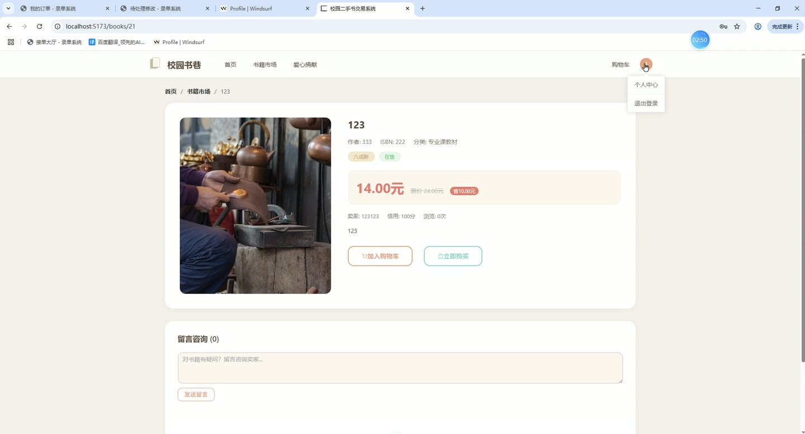
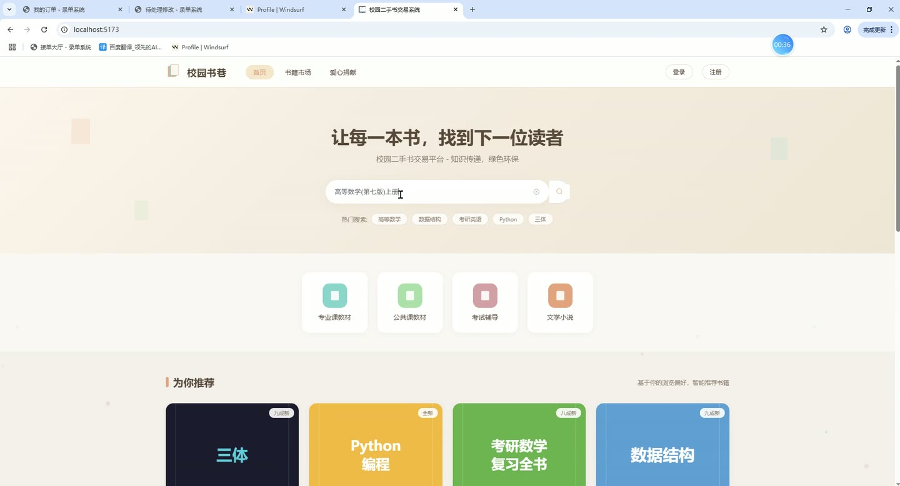
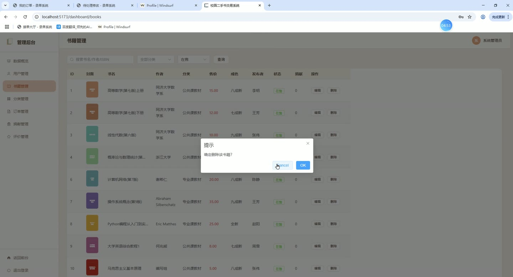
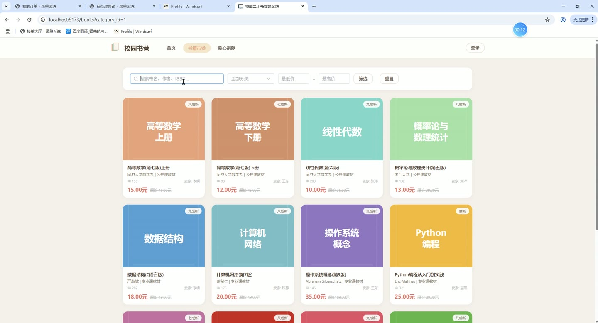
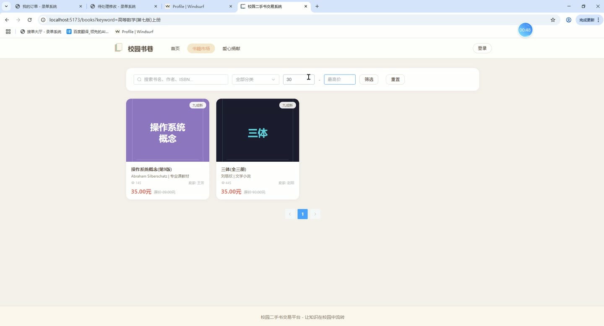
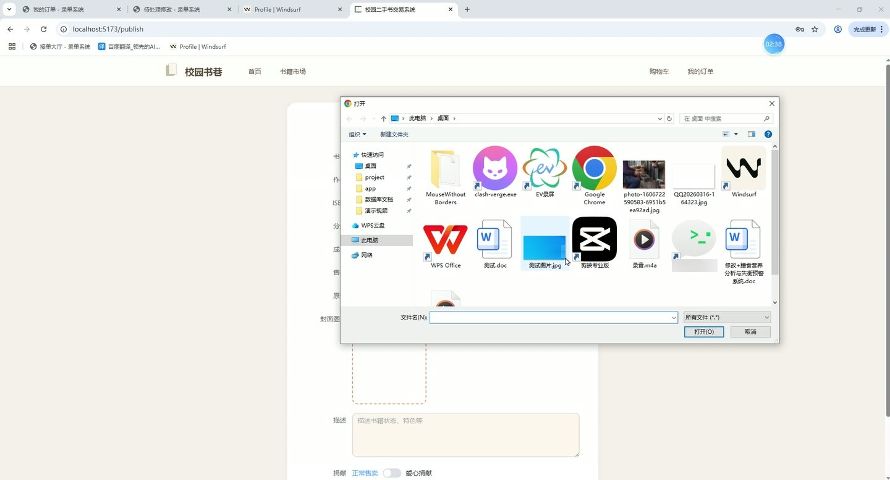

# (附文档)Python+Django+Vue3 校园二手书交易系统

**技术栈**：Python、Django、机器学习、Vue3、MySQL

### 系统简介

本系统是一套基于 Python + Django + Vue3 的校园二手书交易平台，采用前后端分离架构，后端通过 Django REST Framework 提供 API 接口，前端使用 Vue3 单页应用。系统包含普通用户端与管理员端两类角色，覆盖书籍发布、浏览检索、智能推荐、购物车、下单交易、留言评论、信用评价、爱心捐献及后台数据统计等完整业务闭环。
 
### 核心功能
 
### 普通用户端

 
- 账号注册：填写用户名、密码、昵称、手机号、邮箱完成注册，默认角色为 student，初始信用分 100。 
- 账号登录：使用用户名与密码登录，系统校验账号状态，被禁用账号无法登录，登录后按角色跳转前台或后台。 
- 个人资料维护：查看并修改昵称、手机号、邮箱、头像等个人信息。 
- 书籍浏览与检索：支持按书名、作者、ISBN 关键字搜索，可按分类、价格区间、是否捐献、在售状态、发布者筛选，并支持排序与分页。 
- 书籍详情查看：查看书籍封面、多图、成色、原价、售价、描述等信息，浏览时自动累加浏览量并记录浏览行为。 
- 智能推荐：根据用户浏览、加购、购买等行为记录，通过推荐算法返回个性化书籍列表，无行为数据时回退为按浏览量推荐。 
- 发布二手书：填写书名、作者、ISBN、分类、售价、原价、成色、描述并上传封面与多图，发布后状态为在售。 
- 编辑与下架书籍：修改自己发布书籍的标题、价格、成色、图片、状态等信息，或删除已发布书籍。 
- 爱心捐献：将书籍标记为捐献书籍发布，供其他用户免费领取。 
- 购物车管理：将书籍加入购物车、查看购物车列表、移除购物车条目，重复加入时给出提示。 
- 下单购买：从购物车或书籍页选择书籍下单，系统按卖家自动拆单生成订单号，下单后自动清理对应购物车记录。 
- 订单管理：以买家或卖家身份查看订单列表，按订单状态筛选并分页，可更新订单状态，订单完成时书籍状态自动置为已售。 
- 留言评论：在书籍详情页发表留言，支持通过父留言 ID 进行回复，查看书籍下全部留言。 
- 信用评价：针对已完成订单对交易对方进行评分与文字评价，查看收到的评价记录。 
- 文件上传：上传书籍封面与图片，系统以 UUID 重命名后保存并返回访问地址。
 
### 管理员端

 
- 数据概览：查看注册学生数、书籍总数、订单总数、捐献书籍数及累计交易额等核心指标。 
- 分类分布统计：以饼图展示各书籍分类下的书籍数量占比。 
- 价格区间统计：以柱状图展示不同价格区间的书籍数量分布。 
- 月度订单趋势：以柱线组合图展示各月订单数与交易额变化。 
- 成色分布统计：以饼图展示不同成色书籍的数量分布。 
- 用户管理：按用户名或昵称搜索、按角色筛选用户列表，编辑昵称、手机号、邮箱、角色、信用分，并启用或禁用账号。 
- 书籍管理：按关键字、分类、状态筛选书籍列表，编辑书籍信息与上传封面，修改在售/下架状态或删除书籍。 
- 分类管理：新增、编辑、删除书籍分类，并设置分类排序值。 
- 订单管理：按订单号或买家搜索、按状态筛选订单列表，查看订单明细书籍，对待付款订单执行取消、对已付款订单执行完成操作。 
- 捐献管理：查看全部捐献书籍，对可领取书籍执行下架操作或删除捐献书籍。 
- 评价管理：按被评价人搜索信用评价记录，查看评价人、被评价人、评分星级与评价内容。
 
### 技术栈

 后端框架Python + Django + Django REST Framework ORMDjango ORM（模型 managed=False 映射已有数据表） 权限与认证基于角色的登录校验，SHA256 密码加密，前端路由守卫控制 auth/admin 访问 推荐算法基于用户行为（浏览/加购/购买）权重的个性化推荐 前端框架Vue3 + Vue Router UI 组件库Element Plus 图表库ECharts 构建工具Vite 数据库MySQL 核心数据表sys_user、book_category、book、cart、order、order_item、comment、credit_review、user_behavior
 
### 交付内容

 
- 后端完整源码 
- 前端完整源码 
- 数据库初始化脚本 
- 万字文档

## 界面展示

---

## 获取完整源码 + 万字文档

本仓库为项目介绍页。**完整前后端源码、数据库初始化脚本、万字项目文档**，请加微信 `kangkangcode`，或访问 [codekk.top](http://codekk.top) 获取。

可作课程设计 / 毕业设计参考，支持远程部署调试。